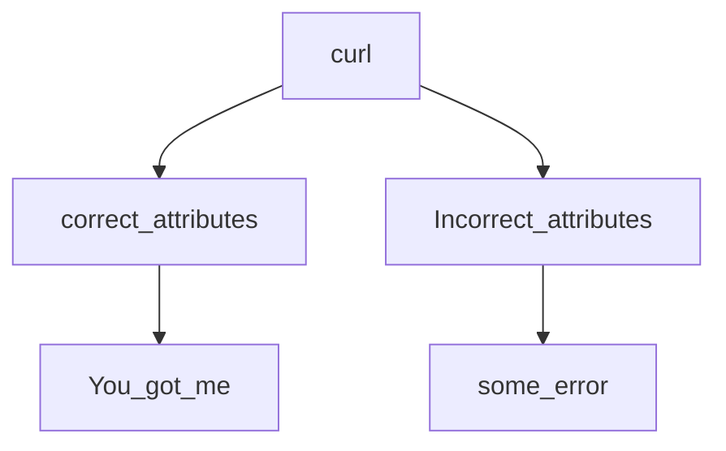

# How I acheived task 102

## ❓Project task❓
```
Write a Bash script that makes a request to 0.0.0.0:5000/catch_me that causes the server to respond with a message containing You got me!, in the body of the response.

You have to use curl
You are not allow to use echo, cat, etc. to display the final result
```

## ❗Solution❗

## 1️⃣
The first clue is in the wording of the file "catch_me" which implies that there will be a number of redirects, and depending on what input was given is where the redirect would take you.

Obiously, we want to end in you_got_me.
